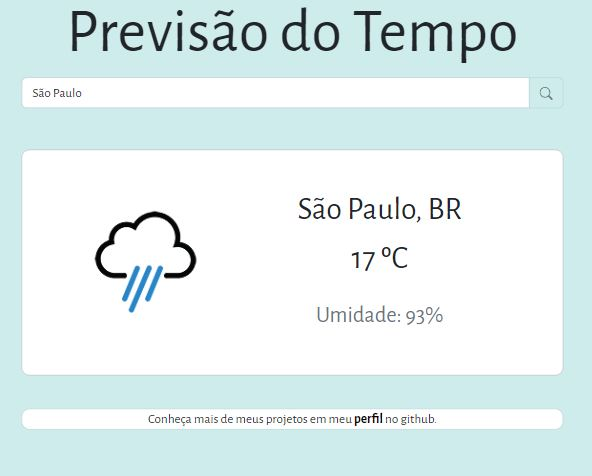

## Aplicativo para WEB de Previsão do Tempo

Consumindo API do site https://home.openweathermap.org para desenvolvimento de uma aplicação voltada
para previsão do tempo, onde será possível pesquisar pelo nome da cidade e terá um retorno com a previsão do tempo para o dia atual.

## Tecnologias

Projeto desenvolvido com HTML5, CSS3, Javascript e Bootstrap5. Hospedado no Vercel para visualização ao vivo.

## Planejamento
[x]Layout Mobile 
[x]Layout Desktop 
[x]Responsividade 
[x]Capturar INPUT com JS. 
[X]Integrar API Weather 
[x]Fazer com que INPUT se relacione com a API. 
[]Implementar geolocalização. 

## Imagem do Projeto

